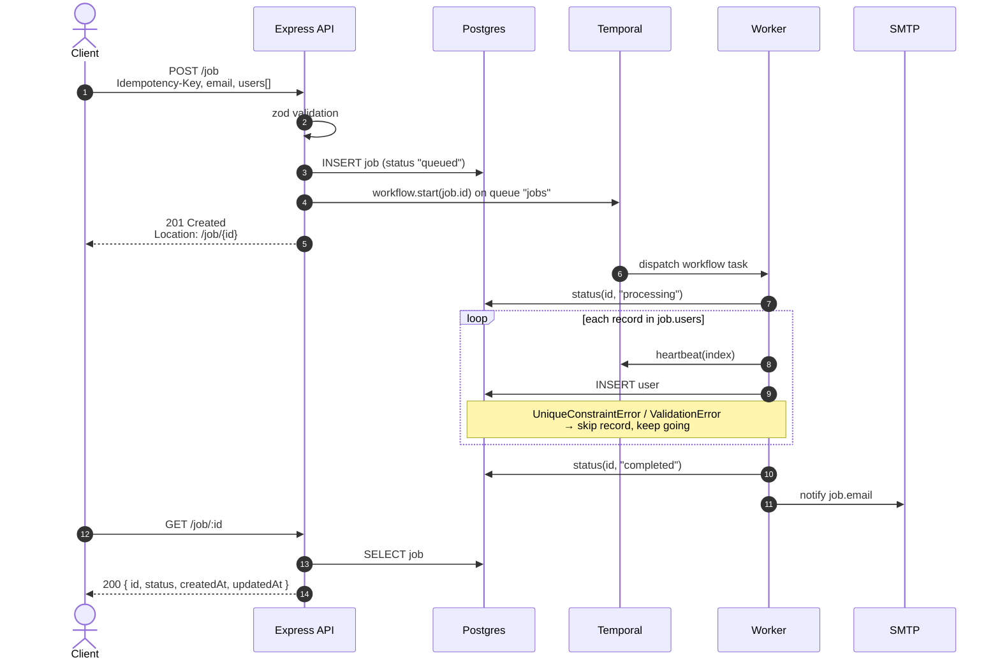
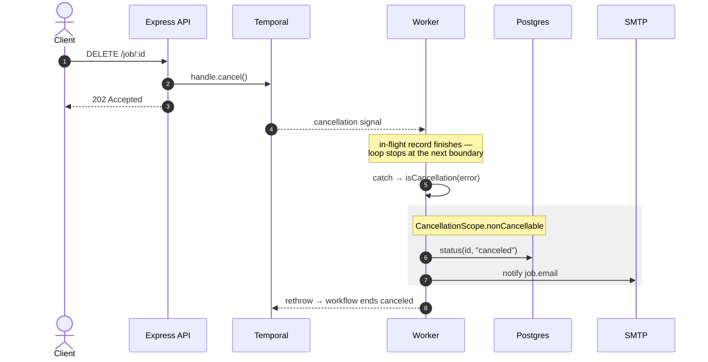
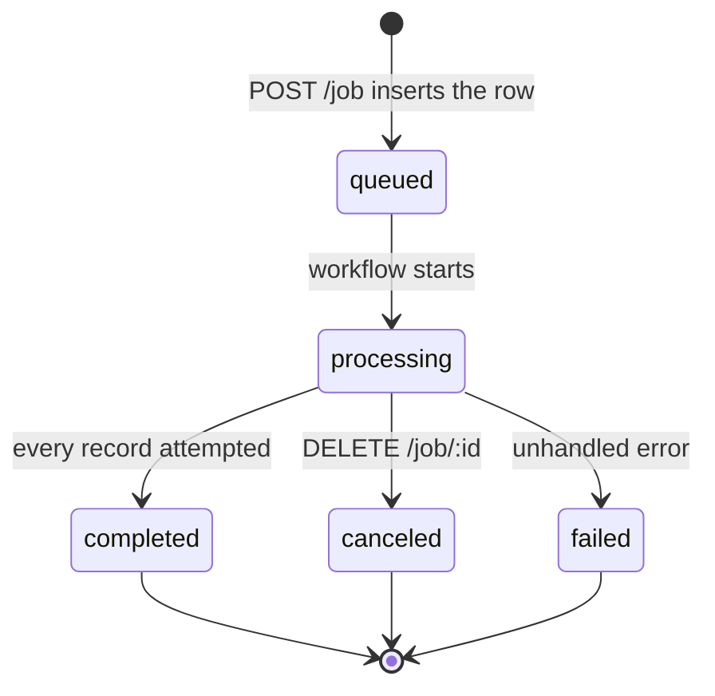

# Makai

- The high-level architecture used was to implement a system to accept jobs via the POST endpoint returning immediately to prevent timeouts and to facilitate scaling, relying on Temporal to process jobs asynchronously.
- The major components are Express to standup endpoints, and Temporal as a durable job processing engine complete with failure recovery.
- A few of the hardest problems were the failure recovery which was ultimately offloaded to Temporal, and ...
- Assumptions were made implementing the cancel endpoint as a DELETE given jobs are cancelled but job records remain, this should be iterated on.
- This project was developed by hand with the assistance of Claude Desktop for reference, though I stopped short of implementing with Claude Code with the exception of the diagrams in this file.

## Architecture

The API never imports users itself. It validates the request, persists the batch as a
single `job` row, hands the job ID to Temporal, and returns immediately. A separate
worker process does the actual work, which is what makes the import durable across
restarts and cooperatively cancelable.

### Submitting and processing a job



Each record is heartbeated with its index before insertion. If the activity is retried,
`processJob` reads `heartbeatDetails` and resumes at that index rather than replaying
the whole batch — so a worker crash mid-import does not re-insert what already landed.

### Cancellation



The terminal status write is wrapped in `CancellationScope.nonCancellable` so the job
row and the notification still go out after the workflow itself has been canceled.
Records imported before cancellation are kept; there is no rollback.

### Job status



Entering `completed`, `canceled`, or `failed` triggers the notification email to the
address supplied on submission. `queued` and `processing` do not.

## Local Install

```bash
brew install postgresql@17
brew services start postgresql@17
brew install temporal
createdb makai
git clone [repo url]
cd mkai
npm install
cp .env.example .env
npm run sync
```

## Local Development

```bash
npm run temporal
npm run worker
npm run dev
```

## API Endpoints

### `POST /job`

Submits a batch of user records for import and starts the workflow that processes them.

**Headers**

| Header            | Required | Description                                           |
| ----------------- | -------- | ----------------------------------------------------- |
| `Content-Type`    | yes      | `application/json`                                    |
| `Idempotency-Key` | yes      | UUID v4. Resubmitting the same key will not duplicate work. |

**Body**

| Field             | Type   | Required | Description                                      |
| ----------------- | ------ | -------- | ------------------------------------------------ |
| `email`           | string | yes      | Address notified when the job reaches a terminal state |
| `users`           | array  | yes      | At least one record                              |
| `users[].name`    | string | yes      | Trimmed; must not be empty                       |
| `users[].email`   | string | yes      | Lowercased before storage; unique across users   |
| `users[].phone`   | string \| null | yes | Trimmed; may be `null`                       |

**Example**

```bash
curl -X POST http://localhost:3000/job \
  -H 'Content-Type: application/json' \
  -H 'Idempotency-Key: 3f8c1d2e-9b7a-4c5d-8e1f-2a3b4c5d6e7f' \
  -d '{
    "email": "you@example.com",
    "users": [
      { "name": "Avery Alvarez", "email": "avery.alvarez@example.com", "phone": "+1-531-354-7468" },
      { "name": "Blake Hayes",   "email": "blake.hayes@test.dev",      "phone": null }
    ]
  }'
```

**`201 Created`**

The `Location` header points at the status endpoint for this job.

```json
{
  "id": "a3f1c2d4-5e6f-4a7b-8c9d-0e1f2a3b4c5d",
  "status": "queued",
  "createdAt": "2026-09-18T22:14:03.221Z",
  "updatedAt": "2026-09-18T22:14:03.221Z"
}
```

**Errors**

| Status | Condition                                                      |
| ------ | -------------------------------------------------------------- |
| `500`  | Unexpected server error                                        |

---

### `GET /job/:id`

Returns the current state of a job. Safe to poll.

**Parameters**

| Parameter | Type      | Description                                |
| --------- | --------- | ------------------------------------------ |
| `id`      | UUID v4   | Job identifier returned by `POST /job`     |

**Example**

```bash
curl http://localhost:3000/job/a3f1c2d4-5e6f-4a7b-8c9d-0e1f2a3b4c5d
```

**`200 OK`**

```json
{
  "id": "a3f1c2d4-5e6f-4a7b-8c9d-0e1f2a3b4c5d",
  "status": "processing",
  "createdAt": "2026-09-18T22:14:03.221Z",
  "updatedAt": "2026-09-18T22:14:09.884Z"
}
```

**Errors**

| Status | Condition                          |
| ------ | ---------------------------------- |
| `500`  | Unexpected server error            |

---

### `DELETE /job/:id`

Requests cancellation of a running job.

**Parameters**

| Parameter | Type    | Description                            |
| --------- | ------- | -------------------------------------- |
| `id`      | UUID v4 | Job identifier returned by `POST /job` |

**Example**

```bash
curl -X DELETE http://localhost:3000/job/a3f1c2d4-5e6f-4a7b-8c9d-0e1f2a3b4c5d
```

**`202 Accepted`**

**Errors**

| Status | Condition                                        |
| ------ | ------------------------------------------------ |
| `500`  | Unexpected server error                          |